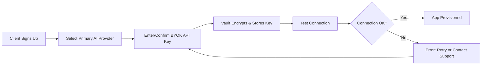

# Passaggio Boutique Agency — Standard Operating Procedure (SOP)

**Version:** 1.3  
**Effective date:** 2026-06-23
**Owner:** Passaggio IDE / Sherley Belleus  
**Purpose:** This document is the single source of truth for how Passaggio builds, delivers, and onboards custom client applications.

---

## 1. Workspace Organization

The **Obsidian Control Center** vault (`Building Obsidian/Obsidian Control Center/`) is the single source of truth for the Passaggio App Ecosystem. Use this hierarchy as the master template. When working on a client, open **only** their specific sub-folder in the IDE to prevent context pollution and to keep proprietary client data isolated.

```
Obsidian Control Center
├── 00 - System/                    <-- Rules, templates, and schemas (do not edit in place)
│   ├── templates/                  <-- Master app prototypes (originals; copy before editing)
│   └── schemas/                    <-- REST/gRPC/Webhook definitions and integration contracts
├── 01 - Command Center/            <-- Dataview dashboards (6 dashboards deriving from note frontmatter)
├── 02 - Apps/                      <-- 9 app profiles with health scores (e.g., 02.01 - VerifiedSitter Canada)
├── 03 - Clients/
│   ├── Active/                     <-- Active client project notes and code (e.g., acme-realty)
│   ├── Prospects/                  <-- Waitlist entries & qualified leads (Lead Profile template)
│   └── Archive/                    <-- Rejected or archived clients
├── 04 - Pipeline/                  <-- Content, intelligence, and distribution maps
│   ├── Content/                    <-- Social video assets, episodes, and scripts
│   ├── Distribution/               <-- Publishing pipelines
│   └── Intelligence/               <-- Competitor analysis and pain-phrase libraries
├── 05 - Finance/                   <-- Revenue tracking (MRR/Invoices)
├── 06 - QA & Audits/               <-- Queryable audit history
│   └── audit_log/                  <-- Integration execution logs & automated draft histories
├── 07 - Knowledge/                 <-- SOPs, research, and meeting summaries
├── 08 - Inbox/                     <-- Raw captures, email summaries, and staged integration drafts (HITL review)
├── 99 - Attachments/               <-- Global assets (logos, CSS, brand tokens, diagrams, exports)
└── copilot/                        <-- Custom Copilot system prompts and custom templates
```

### Rules
- **Never** modify files directly in `00 - System/templates/`. Copy the master prototype into the client's `03 - Clients/Active/[87-name]/app/` folder first.
- **Always** open张嘴 the client folder as the workspace root before writing code.
- **Never** mix two clients in the same IDE context.
- `99 - Attachments/` contains only non-client-specific, reusable assets approved in `brand/design.md`.
- Use `client_slug` in frontmatter as the immutable foreign key for Dataview dashboards in `01 - Command Center/`.
- **Integrations:** `08 - Inbox/` is the designated directory for staging and human-in-the-loop validation of integration drafts. `00 - System/schemas/` is the single source of truth for REST/gRPC contracts. `06 - QA & Audits/ Conrad/` is reserved for automated integration audits.
- **KaneAI App Planning:** For every new client project, use the [KaneAI_App_Planning_Template.md](kaneai_app_planning_template.md) to structure your Obsidian workspace and define test commands before writing code (see Section 9).

---

## 2. Client Delivery Map (SOP Checklist)

Follow these steps for every new client project, without skipping any.

| Step | Action | Verification |
|------|--------|--------------|
| **1. Setup** | Create a new folder under `03 - Clients/Active/`. | Folder exists with `app/` and `notes.md`. |
| **2. Context Loading** | Read `client-requirements.md` inside the new folder. | Summarize requirements back to the client in `notes.md`. |
| **3. Diff Execution** | Compare requested features against the `00 - System/templates/` master prototype before applying changes. | Produce a written diff in `notes.md` under `## Feature Diff`. |
| **4. Build** | Copy the master prototype into the client's `app/` folder and implement only the agreed changes. | Commit after each logical milestone. |
| **5. QA / Validation** | List all modified files and provide a summary of changes for manual verification. | Checklist in `notes.md` under `## QA Summary`. |
| **6. Documentation** | Update `client-history.md` within the client folder to log every modification, decision, and prompt. | History file is timestamped and signed off. |

### Notes on naming
- Use `Client_[Name]_[Date]` for the root client folder (e.g., `Client_Acme_2026-06-18`).
- Use kebab-case for all file names.
- Keep `client-requirements.md`, `notes.md`, and `client-history.md` in the root of the client folder, not inside `app/`.

---

## 3. Marketing & Onboarding

Use this exact value proposition in all client-facing communications:

> **

---

## 4. Intake Logic

When a new lead or waitlist entry is received, store the intake results in the vault under `08 - Inbox/` before reviewing and updating the system registry.

### 4.1 Intake Results Storage
- Initial (raw) intake results are stored as a markdown note in `08 - Inbox/`  
- File name format: `intake_[client_slug]_[date].md`
- Frontmatter must include:
  - `client_slug`: Immutable identifier
  - `intake_date`: ISO date string
  - `status`: `pending`, `approved`, or `rejected`
  - `source`: How the lead was acquired
  - `notes`: Free-form intake notes

### 4.2 Waitlist Management
- Prospects are stored in `03 - Clients/Prospects/` with a `waitlist` flag in frontmatter
- When approved, move the note to `03 - Clients/Active/` and update the `status` field
- Rejected entries are moved to `03 - Clients/Archive/` with a `rejected` status

---

## 5. Content Creation

Reference materials and research are stored in `07 - Knowledge/` under the appropriate subfolder (`SOPs/`, `Research/`, or `Meetings/`).

### 5.1 File References
- `newworkflow.md` (this file) → `07 - Knowledge/SOPs/newworkflow.md`
- Brand guidelines → `99 - Attachments/brand/design.md`
- Client-specific notes → `03 - Clients/Active/[client-name]/notes.md`

---

## 📋 UNIVERSAL PRODUCTIVITY INTEGRATION MATRIX (OAUTH & HUMAN-IN-THE-LOOP VALIDATION)

This section defines Passaggio’s architectural standard for integrating with external productivity platforms. All integrations follow a strict **Human-in-the-Loop (HITL)** model: the AI stages content as drafts or pending items, and no live, public, or unverified resource is ever created automatically.

### 1. Universal Multi-Platform OAuth Integration Framework

All platform connections use a centralized OAuth 2.0 handler. Tokens are provisioned server-side and stored as encrypted entries in the vault (never in code or client-side memory). The framework below lists **representative examples**; the architecture is deliberately agnostic so that any client-preferred tool can be onboarded by implementing the same `PlatformAdapter` interface.

| Category | Example Platform | API Type | Typical Draft Endpoint | Typical Scope |
|----------|------------------|----------|------------------------|---------------|
| **Task / Project** | Microsoft 365, Asana, Monday.com, ClickUp, Notion, Trello | REST or GraphQL | `POST /tasks` (or GraphQL `create_item`) | `write:tasks` or equivalent |
| **Wiki / Docs** | Confluence, Notion, Google Docs, Coda | REST | `POST /content` or `POST /pages` | `write:content` or equivalent |
| **Dev Tracker** | Jira, Linear, GitHub Issues, GitLab | REST or GraphQL | `POST /issues` | `write:issues` or equivalent |
| **Calendar** | Google Calendar, Outlook | REST | `POST /events` (with `showAs: "free"` or `status: "tentative"`) | `write:calendar` or equivalent |
| **Spreadsheet** | Google Sheets, Airtable, Smartsheet | REST | `POST /rows` or `POST /records` | `write:spreadsheet` or equivalent |
| **Communication** | Slack, Teams, Discord | REST | `POST /messages` (to a private draft channel) | `chat:write` or equivalent |

**Implementation Rule:** The vault provides a `PlatformAdapter` interface. Each platform implements `authenticate()`, `stage_draft()`, and `get_status()`. No adapter exposes a `publish()` or `create_live()` method. When a new platform is requested, a developer only needs to supply the `base_url`, `auth_flow` (OAuth 2.0 / PKCE / API Key), and the `draft_endpoint` mapping. Everything else is inherited from the core HITL pipeline.

### 2. The “Draft-Only” Staging Guardrail

To prevent the AI from ever creating a public or live resource by default, every handler must implement the following guardrail:

- **Default Status:** All items created by the integration handler must be staged with `status: "DRAFT"`, `status: "PENDING_APPROVAL"`, or an equivalent non-public state.
- **Explicit Ban:** Handlers are forbidden from setting `status: "PUBLISHED"`, `status: "ACTIVE"`, or `is_public: true` during the initial staging phase.
- **Human Gate:** A human operator must review the staged draft in the target platform (or Passaggio’s staging dashboard) and manually change the status before the item becomes live.
- **Code Enforcement:** The `stage_draft()` method in every `PlatformAdapter` is required to hard-code the draft status. Any pull request that introduces a live-creation bypass is blocked by CI.

**Example Enforced Schema:**
```json
{
  "title": "QC Review: Homepage Hero Copy",
  "body": "Draft content generated by Cohere/Vertex AI mapping...",
  "status": "DRAFT",
  "source_of_truth": "Passaggio_Staging_ID_12345",
  "ai_confidence_score": 0.94,
  "requested_by": "sherley@passaggio.io",
  "target_platform": "asana"
}
```

### 3. AI Content Formatting (Cohere / Google Vertex AI)

Before staging, the AI maps natural language input to a platform-specific structure using tool-calling or structured output generation.

| Model | Engine / API | Use Case | Output Format |
|-------|--------------|----------|---------------|
| Cohere | Command R+ | Mapping natural language to Jira/Asana fields | JSON with `platform`, `task_type`, `mapped_fields` |
| Google Vertex AI | Gemini 1.5 Pro | Complex multi-step reasoning, formatting markdown to Confluence | JSON with `content_blocks`, `metadata`, `workflowState` |

**Required Mockup Payload for Staging:**
```json
{
  "requestId": "req_abc123",
  "source_input": "Schedule a design review for next Tuesday and assign it to the UX team.",
  "ai_mapping": {
    "platform": "microsoft_graph",
    "target_endpoint": "/me/todo/lists/default/tasks",
    "mapped_fields": {
      "title": "Design Review — UX Team",
      "dueDateTime": "2026-06-24T10:00:00Z",
      "importance": "high"
    }
  },
  "workflowState": "PENDING_HUMAN_APPROVAL",
  "staging_payload": {
    "status": "DRAFT",
    "is_public": false,
    "requires_review": true
  },
  "audit_metadata": {
    "model_version": "cohere-command-r-plus-2025_03",
    "inference_timestamp": "2026-06-22T14:30:00Z",
    "vault_reference": "08 - Inbox/staging_abc123.md"
  }
}
```

### 4. Private Enterprise Model Segregation & Auditing Standards

All AI processing and data storage adhere to enterprise-grade privacy and audit controls.

| Standard | Requirement | Implementation |
|----------|-------------|----------------|
| **Zero-Data-Retention** | No provider retains inputs, outputs, or training rights. | Enforced via enterprise Azure / GCP contracts with ZDR riders. Local inference preferred for sensitive prompts. |
| **Encryption at Rest** | All vault data, tokens, and payloads encrypted. | AES-256. Keys managed by the Passaggio Key Vault (HashiCorp Vault or AWS KMS). |
| **Immutable Audit Logging** | Every staging action is logged immutably in append-only storage. | `06 - QA & Audits/audit_log/YYYY-MM/T-platform-draft-uuid.jsonl`. Tamper-evident hashing (SHA-256 chain). |
| **Draft-Only Schema Enforcement** | Schemas do not allow a `"LIVE"` or `"PUBLISHED"` status at the integration layer. | JSON Schema validation in the `PlatformAdapter` pipeline. CI fails on schema additions that introduce live-creation fields. |

**Audit Log Entry Example:**
```json
{
  "event_id": "evt_7f3a9b2c",
  "timestamp": "2026-06-22T14:30:01Z",
  "actor": "passaggio_ai_staging_engine",
  "action": "STAGE_DRAFT",
  "target_platform": "monday",
  "vault_reference": "08 - Inbox/staging_abc123.md",
  "workflow_state": "PENDING_HUMAN_APPROVAL",
  "checksum": "sha256:a3f5b..."
}
```

---

## 6. Integration Architecture

### 6.1 MCP (Model Context Protocol) Handlers & SDKs

Passaggio uses the **Model Context Protocol (MCP)** as the primary interface for extending AI capabilities across client environments. MCP provides a standardized way for AI models to discover and invoke tools, access external data, and interact with client systems.

**Core Components:**
- **MCP Server:** Runs as a local or remote process that exposes tools, resources, and prompts to the AI model
- **MCP Client:** Embedded in the Passaggio app; connects to MCP servers via stdio or SSE (Server-Sent Events)
- **Tools:** Functions that the AI can call (e.g., `read_file`, `search_database`, `send_email`)
- **Resources:** Data sources the AI can read (e.g., `file://`, `db://`, `api://` URIs)
- **Prompts:** Pre-defined templates the AI can use for common tasks

**Vault Integration:**
- **Custom Prompts:** `copilot/copilot-custom-prompts/` – version-controlled system instructions for Copilot
- **MCP Server Configs:** `.continue/mcpServers/` – YAML definitions for local and remote MCP servers
- **Shared Templates:** `00 - System/templates/` – canonical note and audit templates
- **Schema Documents:** `00 - System/schemas/` – OpenAPI, gRPC, and JSON schemas for all integrations

**Implementation Standard:**
```typescript
// Example MCP Tool Definition
interface MCPTool {
  name: string;
  description: string;
  inputSchema: JSONSchema;
  handler: (args: unknown) => Promise<unknown>;
}

// All MCP tools must include:
// - Descriptive name and description for AI discoverability
// - Strict JSON schema validation for inputs
// - Graceful error handling with actionable feedback
// - Audit logging for all invocations
```

**Development Rule:** When building a new integration, always start with an MCP tool definition. The tool acts as the contract between the AI model and the external system. Test tools independently before wiring them into the full agent pipeline.

### 6.2 Embedded iPaaS vs. Self-Made Integration

When deciding how to connect client systems, evaluate the following matrix:

| Factor | Embedded iPaaS (Paragon) | Self-Made Integration |
|--------|--------------------------|----------------------|
| **Time to Market** | Days (pre-built connectors) | Weeks–Months (custom development) |
| **Maintenance Burden** | Vendor-managed (updates, bug fixes) | Client-owned (ongoing maintenance) |
| **Customization** | Limited to vendor's feature set | Unlimited (full control over logic) |
| **Scalability** | Handles scaling automatically | Requires architecture planning |
| **Cost Structure** | Usage-based SaaS fees | Upfront development + infrastructure |
| **Security** | SOC 2, GDPR compliant out-of-the-box | Must implement compliance independently |
| **Vendor Lock-in** | High dependency on vendor stability | Full ownership of integration code |

**Passaggio Recommendation:**
- **Use Embedded iPaaS** for common integrations (Salesforce, HubSpot, Slack, Google Workspace) where the connector already exists and the use case is standard (sync contacts, create tasks, post messages).
- **Build Self-Made** when the integration logic is business-critical, requires custom data transformations, or when the client has strict data residency requirements that the iPaaS cannot meet.
- **Hybrid Approach:** Use iPaaS for rapid prototyping and MVP delivery, then gradually migrate high-value or sensitive integrations to self-built components as the client relationship matures.

### 6.3 Plugin Architecture (gRPC / REST / Webhooks)

For maximum flexibility, Passaggio supports three integration patterns that clients can mix and match:

**1. gRPC (High-Performance Internal Services)**
- **Use case:** Internal microservices, real-time data streaming, low-latency requirements
- **Schema:** Protocol Buffers (`.proto` files) versioned and stored in `00 - System/schemas/`
- **Security:** mTLS required for all gRPC connections
- **Example:** AI inference pipeline, real-time analytics

**2. REST (External API Standard)**
- **Use case:** Third-party integrations, client-facing APIs, browser-based requests
- **Schema:** OpenAPI 3.0 specs stored in `00 - System/schemas/` and auto-generated documentation
- **Security:** OAuth 2.0 / PKCE for auth; API keys for service-to-service
- **Example:** Client dashboard, external partner integrations

**3. Webhooks (Event-Driven Async)**
- **Use case_ROcase:** Real-time notifications, async job completion, event-driven architectures
- **Schema:** Webhook payloads validated against JSON schemas; idempotency keys required
- **Security:** HMAC-SHA256 signature verification; retry logic with exponential backoff
- **Example:** Payment completion, file processing done, external system state changes

**Plugin Interface Standard:**
All plugins (regardless of protocol) must implement:
```typescript
interface PassaggioPlugin {
  name: string;
  version: string;
  protocols: ('grpc' | 'rest' | 'webhook')[];
  authenticate(credentials: unknown): Promise<AuthResult>;
  healthCheck(): Promise<HealthStatus>;
  auditLog(): Promise<AuditEntry[]>;
}
```

---

## 7. Security & Compliance

### 7.1 Compliance Standards (SOC 2, GDPR, HIPAA)

Passaggio operates under a compliance-first architecture. Every client deployment must meet the following standards:

| Standard | Requirement | Implementation |
|----------|-------------|----------------|
| **SOC 2 Type II** | Annual audit; controls for security, availability, confidentiality | Third-party auditor; continuous monitoring via Vanta or Drata |
| **GDPR** | Data minimization; right to erasure; explicit consent; DPA | Privacy-by-design; automated data retention policies; Data Processing Agreement per client |
| **HIPAA** (if applicable) | BAA with client; encryption at rest and in transit; access logging | Dedicated HIPAA-compliant infrastructure; BAA signed before data handling |

**Compliance Checklist for Every Client:**
- [ ] SOC 2 Type II audit report reviewed and controls validated (annual)
- [ ] GDPR Data Processing Agreement (DPA) signed with client
- [ ] HIPAA Business Associate Agreement (BAA) signed (if handling PHI)
- [ ] Encryption at rest (AES-256) and in transit (TLS 1.3) verified
- [ ] Access logging and monitoring infrastructure active (SIEM/Splunk)
- [ ] Data retention and automated deletion policies configured
- [ ] Incident response plan documented, assigned, and tested (quarterly tabletop)

### 7.2 Local AI + BYOK (Bring Your Own Key)

To ensure client data never touches unauthorized third-party model providers, Passaggio implements a **local-first, BYOK-fallback** AI strategy.

**Local AI Stack (Default):**
| Component | Technology | Purpose |
|-----------|------------|---------|
| **Inference Engine** | Ollama | Local model serving; no external API calls |
| **Base Model** | Llama 3 (8B/70B) | General-purpose reasoning; runs on client hardware or Passaggio-managed edge |
| **Embedding Model** | nomic-embed-text | Local vector embeddings for RAG pipelines |
| **GPU Acceleration** | Apple Metal (M-series) / NVIDIA CUDA | Optimized inference performance |

**BYOK Cloud Fallback:**
When local models are insufficient (e.g., complex multi-step reasoning, large context windows), the system falls back to cloud providers using the client's own API keys.

| Provider | Model | Use Case | Key Management |
|----------|-------|----------|---------------|
| **OpenAI** | GPT-4o, o1 | Complex reasoning, code generation | Client-provided key via secure onboarding UI |
| **Anthropic** | Claude 3.5 Sonnet | Long-context analysis, creative writing | Client-provided key via secure onboarding UI |
| **Google** | Gemini 1.5 Pro | Multi-modal processing | Client-provided key via secure onboarding UI |
| **Cohere** | Command R+ | Natural language to structured data mapping | Client-provided key via secure onboarding UI |

**Key Vault Architecture:**
```
Client API Key → Encrypted at Rest (AES-256-GCM)
                → Stored in HashiCorp Vault / AWS KMS / Azure Key Vault
                → Never logged, never transmitted to Passaggio servers
                → Rotated automatically every 90 days or on client request
```

**Model Routing Logic:**
```typescript
async function routeToModel(prompt: string, clientConfig: ClientConfig) {
  const localResult = await ollama.generate({ model: 'llama3', prompt });
  if (localResult.confidence > 0.85) return localResult;

  // Fallback to BYOK cloud if local model is insufficient
  const cloudProvider = clientConfig.preferredProvider || 'openai';
  return await byokFallback.generate({
    provider: cloudProvider,
    apiKey: await vault.getKey(clientConfig.clientId, cloudProvider),
    prompt,
    maxTokens: 4096
  });
}
```

**Security Guarantees:**
- Zero-data-retention (ZDR) riders are included in all cloud provider enterprise contracts
- Local inference is always attempted first; cloud is opt-in per client
- All cloud calls are logged in the immutable audit trail (see Section 4.4)
- Client can revoke cloud provider access instantly via the onboarding UI (Section 10)

### 7.3 Automated Red Teaming & Verification

Passaggio operates a **defense-in-depth** security posture with automated verification at every layer.

**Layer 1: Automated Red Teaming**
| Tool | Purpose | Integration |
|------|---------|-------------|
| **Claude (Red Teamer)** | Automated adversarial prompt generation; tests for jailbreaks, data leakage, harmful outputs | Runs nightly via GitHub Actions on staging environment |
| **NVIDIA Garak** | Probing LLM vulnerabilities (prompt injection, hallucination, data extraction) | Integrated into CI pipeline; blocks merges on high-severity findings |
| **Augustus (Praetorian)** | Advanced adversarial testing for enterprise AI systems | Quarterly external audit engagement |

**Layer 2: CI/CD Security Gates**
```yaml
# .github/workflows/security.yml (excerpt)
jobs:
  security-scan:
    runs-on: ubuntu-latest
    steps:
      - uses: actions/checkout@v4
      - name: Snyk Dependency Scan
        uses: snyk/actions/node@master
      - name: Trivy Container Scan
        uses: aquasecurity/trivy-action@master
      - name: Semgrep Static Analysis
        uses: returntocorp/semgrep-action@v1
      - name: Garak LLM Vulnerability Scan
        run: garak --model_type huggingface --model_name meta-llama/Llama-3-8b --probes all
```

**Layer 3: Runtime Guardrails**
| Tool | Function | Enforcement |
|------|----------|-------------|
| **LLM Guard** | Input/output filtering; PII detection; toxicity scoring | Every API request; blocks on threshold breach |
| **NeMo Guardrails** | Conversational safety rails; topic restriction; fact-checking | Active on all chat/agent interfaces |
| **Guardrails AI** | Schema/semantic validation of structured outputs | Enforced on all AI-generated JSON and database writes |

**Layer 4: Continuous Compliance Monitoring**
- **Vanta / Drata:** Automated evidence collection for SOC 2 Type II, GDPR, and HIPAA controls
- **Real-time dashboards:** Security score, open vulnerabilities, compliance drift alerts
- **Quarterly external audits:** Third-party penetration testing and code review

---

## 8. Care Plan & Maintenance

Every Passaggio client app is delivered with an optional **Care Plan** — a structured maintenance and security service.

### 8.1 Auto-Fixing Security Tools

| Tool | What It Does | Auto-Fix Capability |
|------|--------------|---------------------|
| **Snyk** | Scans dependencies for known CVEs | Opens automated PRs with patched versions; auto-merges if CI passes |
| **Mend.io** | Open-source license and vulnerability management | Auto-generates remediation tickets; suggests alternative packages |
| **Dependabot** | GitHub-native dependency updates | Auto-merge on patch-level updates after CI pass |

### 8.2 AI Telemetry & Observability

| Tool | Purpose | Data Collected |
|------|---------|----------------|
| **Langfuse** | LLM tracing, cost tracking, performance monitoring | Prompts, responses, tokens, latency, cost per client |
| **Literal AI** | AI step debugging and workflow tracing | Execution graphs, tool calls, model parameters |
| **Arize Phoenix** | Drift detection, model evaluation, A/B testing | Input/output distributions, evaluation scores |
| **OpenTelemetry** | Standardized instrumentation across all services | Traces, metrics, logs (structured, vendor-agnostic) |

**Privacy Note:** All telemetry data is aggregated and anonymized per-client. Individual user queries are never stored in telemetry systems unless explicitly opted-in.

### 8.3 Monthly Care Plan Checklist

```markdown
## Care Plan — [Client Name] — [Month Year]

### Security
- [ ] Dependency vulnerability scan reviewed; Snyk/mend criticals resolved
- [ ] Runtime guardrail violations reviewed (LLM Guard/NeMo logs)
- [ ] Access logs audited for anomalies
- [ ] API key rotation check (90-day cycle)

### Compliance
- [ ] Data retention/deletion jobs executed successfully
- [ ] Compliance monitoring dashboard checked (Vanta/Drata)
- [ ] No outstanding audit findings

### Performance
- [ ] LLM latency p95 < 2s (measured via Langfuse)
- [ ] Error rate < 0.1% (measured via OpenTelemetry)
- [ ] Client-facing uptime ≥ 99.9%

### Client Communication
- [ ] Monthly summary report generated and sent
- [ ] Any client feedback or feature requests logged in `03 - Clients/Active/[client]/notes.md`
```

### 8.4 Incident Response SLA

| Severity | Response Time | Resolution Target | Escalation |
|----------|---------------|-------------------|------------|
| **Critical** (system down, data breach backsplash) | 15 minutes | 4 hours | Immediate CEO + legal |
| **High** (major feature broken) | 1 hour | 24 hours | Engineering lead |
| **Medium** (partial degradation) | 4 hours | 72 hours | Assigned engineer |
| **Low** (cosmetic, minor bug) | 24 hours | 1 week | Support queue |

---

## 9. Pre-Client Delivery QA with KaneAI

### 9.1 Introduction to KaneAI
KaneAI is the primary GenAI-native software testing agent used at Passaggio. It enables the team to perform comprehensive quality assurance using natural language commands, ensuring that all client applications meet our high standards before delivery.

### 9.2 Key Capabilities
- **Pre-Delivery Natural Language QA**: Convert plain English test scenarios into executable test suites with minimal configuration.
- **Automated Feature Verification**: KaneAI auto-generates test cases from PRDs, Jira tickets, or simple UI screenshots, providing immediate coverage for new features.
- **Intelligent Test Planner**: Automatically designs comprehensive test scenarios, including edge cases and regression paths, based on application changes.
- **Auto-Healing & Versioning**: When UI elements change, KaneAI intelligently updates test steps, flags differences, and prevents tests from breaking.
- **Multi-Device & Browser Cloud**: Execute tests across thousands of real device and browser combinations to ensure maximum responsiveness and compatibility.
- **Developer Hand-off & Export**: Export test cases into structured, reusable code (Selenium, Appium, Playwright, Cypress) for engineering teams.

### 9.3 Pre-Delivery Checklist
Before handing over any completed application to the client, the following KaneAI-powered QA steps must be completed:
- [ ] **Intake Verification**: Run KaneAI against the client intake form to ensure all requirements are captured.
- [ ] **Core Workflow Testing**: Use natural language commands to verify all primary user journeys (e.g., "User signs up, completes onboarding, and reaches dashboard").
- [ ] **Cross-Browser/Device Validation**: Execute KaneAI tests across Chrome, Firefox, Safari, and mobile Safari to confirm consistent behavior.
- [ ] **Regression Testing**: KaneAI automatically generates and runs regression tests based on historical data to catch unintended side effects.
- [ ] **Accessibility Audit**: Utilize KaneAI to perform automated accessibility checks (WCAG compliance) and generate a report.
- [ ] **Security Scan**: Run KaneAI's security-focused tests to identify common vulnerabilities (OWASP Top 10).
- [ ] **Performance Benchmarking**: Use KaneAI to simulate concurrent users and measure key performance metrics (load times, response times).
- [ ] **Documentation Review**: Verify that all KaneAI-generated test reports, summaries, and exported code are included in the client hand-off package.

> [!info] KaneAI App Planning
> For detailed app planning and test command generation, use the [KaneAI_App_Planning_Template.md](kaneai_app_planning_template.md) in your Obsidian vault. This template provides structured frontmatter, core workflow mapping, and natural language test command examples to guide your KaneAI setup.

---

## 10. Testing & QA

### 9.1 End-to-End (E2E) UI Testing

| Framework | Use Case | Integration |
|-----------|----------|-------------|
| **Playwright** | Primary E2E framework; cross-browser testing; mobile emulation | `npm run test:e2e` in CI; runs on every PR |
| **Cypress** | Alternative for client projects with specific Cypress requirements | Configured via separate `cypress/` directory |
| **MSW (Mock Service Worker)** | API mocking for isolated frontend testing; simulates backend responses during development | Integrated into dev server and test environment |

**E2E Coverage Requirements:**
- Critical user journeys: 100% coverage (login, intake, core workflow, logout)
- Error paths: At least 1 test per expected failure mode
- Cross-browser: Chrome, Firefox, Safari, Mobile Safari (iOS)
- Visual regression: Percy or Chromatic for UI snapshot diffing

**Example Playwright Test:**
```typescript
import { test, expect } from '@playwright/test';

test('client intake workflow', async ({ page }) => {
  await page.goto('/intake');
  await page.fill('[name="company"]', 'Acme Corp');
  await page.fill('[name="email"]', 'admin@acme.com');
  await page.click('button[type="submit"]');
  await expect(page.locator('.success-message')).toBeVisible();
});
```

### 9.2 Unit & Integration Testing

| Layer | Tool | Coverage Target |
|-------|------|----------------|
| **Frontend** | Vitest + React Testing Library | 80% branch coverage |
| **Backend** | pytest / Jest | 80% branch coverage |
| **API** | Postman/Newman or Hurl | 100% endpoint coverage |
| **Database** | testcontainers (PostgreSQL in Docker) | Integration tests with real schema |

### 9.3 Graceful Degradation

| Failure Mode | Fallback | Monitoring |
|--------------|----------|------------|
| **AI Service Down** | Cached responses → human escalation queue | Alert on inference latency > 5s |
| **Third-Party API Failure** | Retry (exponential backoff, max 5); notify admin | Alert on persistent 4xx/5xx |
| **Database Connection Lost** | Queue writes to local store; sync on recovery | Alert on connection pool exhaustion |
| **Client Key Expired** | Queue requests; auto-email client; surface in UI | Alert on 401 from cloud provider |

---

## 11. Client Onboarding UI

### 10.1 API Key Onboarding Flow



### 10.2 Integration Connection Wizard

| Step | Action | Validation |
|------|--------|------------|
| **1. Select Tools** | Client selects from supported platforms (see Section 1) | At least one integration required |
| **2. Authenticate** | OAuth 2.0 / PKCE flow initiated; token stored encrypted | Token scopes verified against required permissions |
| **3. Map Data** | AI-assisted field mapping from client schema to Passaggio schema | Schema validation; conflict resolution UI |
| **4. Test & Confirm** | Dry-run sync of sample data | Client approves mapped output before live sync |
| **5. Go Live** | Integration status set to `active`; monitoring enabled | Alert configured for sync failures |

### 10.3 Self-Service Configuration

Clients can modify without Passaggio engineering support:
- **AI Model Preferences:** Switch between local and cloud providers; adjust temperature/max tokens
- **Integration Settings:** Add/remove connected platforms; update field mappings
- **User Management:** Invite team members; assign roles (Admin, Editor, Viewer)
- **Data & Privacy:** Request data export; initiate account deletion; review audit logs

### 10.4 Training & Documentation

Every client receives:
- **Onboarding Video:** 15-minute walkthrough of the app and integration setup
- **Interactive Tutorial:** In-app guided tour (Shepherd.js or similar)
- **Documentation Hub:** Searchable knowledge base at `docs.passaggio.io/[client-slug]`
- **Support Channel:** Dedicated Slack/Discord channel for the first 30 days
- **Monthly Office Hours:** Optional 1-hour Q&A session with a Passaggio engineer

---

## 12. Change Log

| Date | Version | Change |
|------|---------|--------|
| 2026-06-18 | 1.0 | Initial SOP release |
| 2026-06-22 | 1.1 | Mapped workspace to Obsidian Control Center vault; added intake results storage in `04 - Pipeline/Intake/` |
| 2026-06-23 | 1.2 | Added Integration Architecture (MCP, iPaaS, Plugin Architecture), Security & Compliance (SOC 2/GDPR/HIPAA, Local AI + BYOK, Automated Red Teaming), Care Plan & Maintenance (auto-fixing tools, telemetry, SLA), Testing & QA (E2E with Playwright, unit testing, MSW, graceful degradation), and Client Onboarding UI (API key flow, integration wizard, self-service) |
| 2026-06-23 | 1.3 | Rooted Integration Architecture to Obsidian Control Center folders (`copilot/`, `.continue/mcpServers/`, `00 - System/schemas/`); moved intake staging from `04 - Pipeline/Intake/` to `08 - Inbox/` and updated SOP header to v1.3 |
